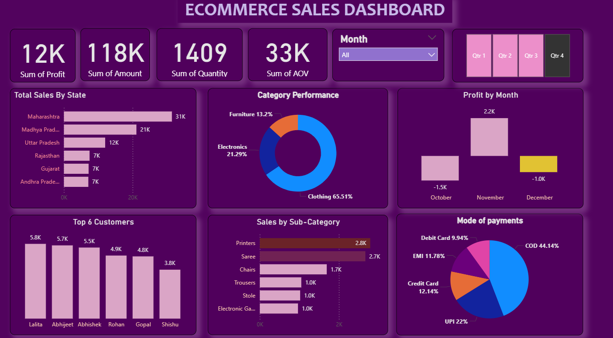
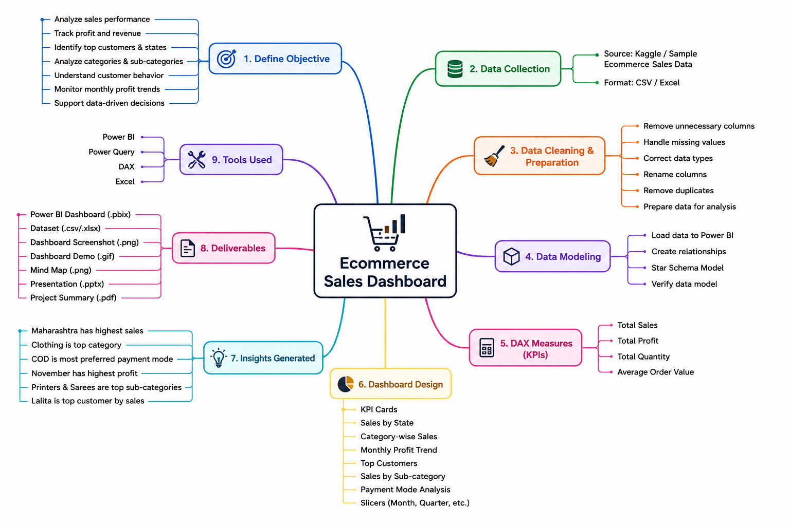

# 📊 Ecommerce Sales Dashboard | Power BI

An interactive **Power BI Dashboard** built to analyze ecommerce sales performance across different states, customers, categories, products, and payment methods. This project transforms raw sales data into meaningful business insights that support data-driven decision-making.

---

# 📸 Dashboard Preview



---

# 🎥 Dashboard Demo


)
---

# 🎯 Project Objective

The objective of this project is to analyze ecommerce sales data and build an interactive dashboard that helps businesses:

* Monitor sales performance
* Track profit and revenue
* Identify top-performing states and customers
* Analyze category and sub-category performance
* Understand customer purchasing behavior
* Monitor monthly profit trends
* Support data-driven business decisions

---

# 📂 Dataset Information

The dataset contains information about:

* Order Date
* Customer Name
* State
* Category
* Sub-category
* Quantity
* Sales Amount
* Profit
* Payment Mode

---

# 🛠 Data Cleaning & Transformation

Data preparation was performed using **Power Query**.

The following steps were completed:

* Removed unnecessary columns
* Checked for missing values
* Corrected data types
* Renamed columns
* Created calculated measures using DAX
* Prepared data for visualization

---

# 📈 Key Performance Indicators (KPIs)

| KPI                    | Description               |
| ---------------------- | ------------------------- |
| 💰 Total Sales         | Total revenue generated   |
| 📈 Total Profit        | Overall business profit   |
| 📦 Total Quantity      | Total products sold       |
| 🛒 Average Order Value | Average revenue per order |

---

# 📊 Dashboard Features

* Interactive Month Filter
* Quarter-wise Analysis
* Sales by State
* Category-wise Sales
* Monthly Profit Trend
* Top Customers
* Sales by Sub-category
* Payment Mode Analysis
* Dynamic KPI Cards

---

# 💡 Business Insights

* Maharashtra generated the highest sales.
* Clothing was the highest-performing category.
* COD was the most preferred payment method.
* November recorded the highest monthly profit.
* Printers and Sarees were the top-performing sub-categories.
* Lalita was the highest revenue-generating customer.

---

# 🧠 Project Workflow

## 🧠 Project Workflow


---

# 🛠 Tools & Technologies

* Power BI
* Power Query
* DAX
* Microsoft Excel

---

# 💼 Skills Demonstrated

* Data Cleaning
* Data Transformation
* Data Modeling
* DAX Measures
* Dashboard Design
* Data Visualization
* Business Intelligence
* Analytical Thinking

---

# 📂 Repository Structure

```text
Ecommerce-Sales-Dashboard
│
├── Dashboard
│   └── ECOMMERCE_SALES DASHBOARD.pbix 
│
├── Dataset
│   └──Details.csv
│   └──Orders.csv
│
├── Images
│   ├── Dashboard.png
│   ├──Ecommerce sales dashboard gif.gif 
│   └──Ecommerce Sales Mindmap.xmind
│
├── Presentation
│   └── Ecommerce-Sales-Dashboard.pptx 
│
├── Summary
│   └── 📊 Ecommerce Sales Dashboard Summary.pdf 
│
└── README.md
```

---

# 🚀 Future Improvements

* Year-wise Sales Analysis
* Sales Forecasting
* Customer Segmentation
* Product Recommendation Dashboard
* Advanced DAX Measures
* Drill-through Report Pages

---

# 👩‍💻 About Me

**Swathi Krishna Suresh**

Aspiring Data Analyst passionate about turning raw data into meaningful business insights.

## Skills

* SQL
* Python
* Power BI
* Excel
* DAX
* Data Visualization

---

⭐ If you found this project interesting, feel free to explore the repository!
